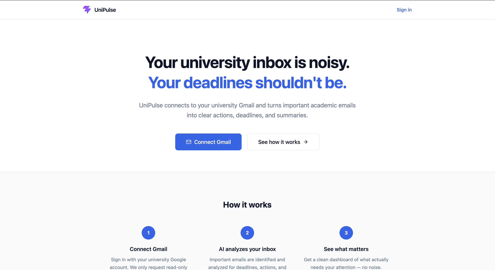
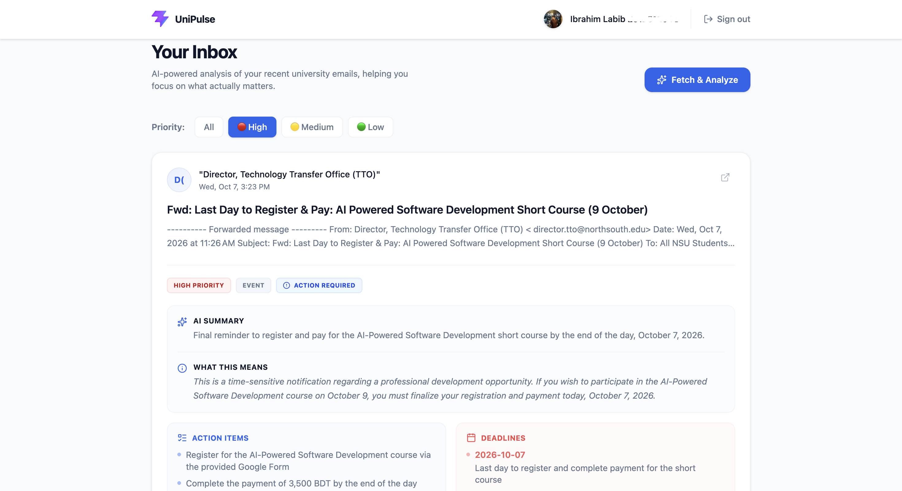
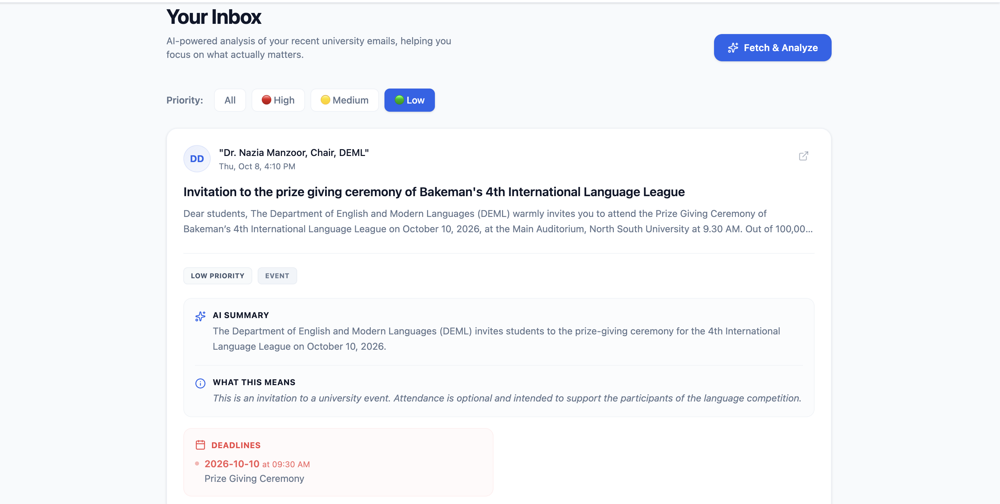

# UniPulse 2.0 🎓📬

**The AI-Powered Academic Command Center for University Students**

UniPulse turns noisy university email inboxes into a high-speed, priority-sorted academic command center. It continuously synchronizes with university Gmail via read-only OAuth, caches emails in local SQLite for sub-second inbox browsing, extracts grounded deadlines and concrete action items using Gemini AI, and organizes them in a dedicated Action Center.

---

## 📸 Screenshots

| 3-Pane Priority Inbox | Action Center & Deadlines | Email Detail & Safe Body |
| :---: | :---: | :---: |
|  |  |  |

---

## ✨ Core Features in UniPulse 2.0

- **⚡ Sub-Second Cached Inbox**:
  - Emails are persisted in SQLite on first sync.
  - Re-opening or browsing your inbox loads instantly (<20ms) from local cache without waiting for Gmail or Gemini APIs.
  - Automatic background synchronization checks for new emails every 15 minutes or on-demand without blocking the UI.
- **🚦 Grounded AI Priority Sorting**:
  - Automatically sorts emails into 🔴 **High Priority** (urgent deadlines, exam schedules, registration clearance), 🟡 **Medium Priority** (course updates, syllabus notices), and 🟢 **Low Priority** (clubs, social announcements).
  - Explicit **Analyzing** state for pending messages — unanalyzed emails are never silently misclassified.
  - Strict anti-hallucination prompting: deadlines and links are only extracted if explicitly present in the original message.
- **🖥️ 3-Pane SaaS Workspace**:
  - **Left Sidebar**: Navigation, unread badges, priority filters, academic course tags (`CSE231`, `PHY108`), sync status, and account controls.
  - **Central Email List**: Debounced search, sorting switcher (AI Priority vs Newest First), initial avatars, unread indicators, and deadline pills.
  - **Right Detail Panel**: Subject, sender info, priority rationale, concise AI summary, required actions, extracted deadlines with confidence badges, and safe collapsible original email.
- **🛡️ Secure HTML Sanitization**:
  - Original email bodies are parsed with BeautifulSoup to strip `<script>`, `<iframe>`, `on*` event handlers, and `javascript:` URIs.
  - Enforces `target="_blank" rel="noopener noreferrer"` on all links to prevent tab-nabbing and XSS attacks.
- **⚡ Academic Action Center**:
  - Unified student task management directly derived from analyzed emails.
  - Complete, edit, filter (upcoming, overdue, completed), or delete tasks.
  - One-click navigation from any task back to its originating email.
- **📊 Daily Academic Briefing**:
  - Real-time synthesis of unread urgent messages, overdue tasks, and 7-day upcoming deadlines calculated instantly from stored SQLite records with zero AI latency.

---

## 🏗️ Architecture

```text
UniPulse 2.0 Architecture
┌────────────────────────────────────────────────────────┐
│                   React 19 + Vite                      │
│        Tailwind CSS v4 · 3-Pane Client Workspace       │
└───────────────▲────────────────────────▲───────────────┘
                │ HTTP (FastAPI REST)    │ Background Sync Polling
┌───────────────▼────────────────────────▼───────────────┐
│                    FastAPI Backend                     │
│  ┌─────────────────┐ ┌───────────────┐ ┌─────────────┐ │
│  │   Auth Router   │ │ Inbox Router  │ │ Tasks Router│ │
│  │ (Session/OAuth) │ │(Cached/Detail)│ │(Action Cent)│ │
│  └────────▲────────┘ └───────▲───────┘ └──────▲──────┘ │
│           │                  │                │        │
│           │            ┌─────▼───────┐        │        │
│           │            │ SQLite DB   │◄───────┘        │
│           │            │(Cached Data)│                 │
│           │            └─────▲───────┘                 │
│  ┌────────▼────────┐         │ (Background Queue)      │
│  │ Gmail Service   │         │                         │
│  │ (OAuth & Sync)  ├─────────┘                         │
│  └────────▲────────┘                                   │
│           │ (googleapiclient)                          │
│  ┌────────▼────────┐                                   │
│  │   Gemini SDK    │                                   │
│  │(Structured JSON)│                                   │
│  └─────────────────┘                                   │
└────────────────────────────────────────────────────────┘
```

---

## 🛠️ Technology Stack

| Component | Technology | Role |
| :--- | :--- | :--- |
| **Frontend** | React 19, TypeScript, Vite, Tailwind CSS v4, Lucide Icons | 3-pane client, responsive layout, debounced search, task manager |
| **Backend** | Python 3.10+, FastAPI, Uvicorn, Starlette Session Middleware | Async REST API, background worker queue, timing logs |
| **Database** | SQLite, SQLAlchemy 2.0 (async), aiosqlite | Persistent cache for email envelope, full bodies, analyses, and action tasks |
| **Email API** | Google API Client (`gmail.readonly` OAuth 2.0) | Read-only fetching with token encryption at rest |
| **AI Engine** | `google-genai` SDK (`gemini-3.1-flash-lite`) | Structured JSON extraction, anti-hallucination prompts |
| **Security** | `cryptography` (Fernet), BeautifulSoup4 | AES token encryption at rest, XSS-safe HTML sanitization |

---

## ⚙️ Getting Started

### Prerequisites

- Python 3.10+
- Node.js 18+ and npm
- Google Cloud Project with Gmail API enabled
- Gemini API Key from [Google AI Studio](https://aistudio.google.com/apikey)

### 1. Clone & Set Up Python Virtual Environment

```bash
git clone https://github.com/LabibCraftsSpells/UniPulse.git
cd UniPulse

python3 -m venv .venv
source .venv/bin/activate
pip install -r requirements.txt
```

### 2. Configure Environment Variables

```bash
cp .env.example .env
```

Edit `.env` with your credentials:

```env
# Google OAuth (from Google Cloud Console)
GOOGLE_CLIENT_ID=your-client-id.apps.googleusercontent.com
GOOGLE_CLIENT_SECRET=your-client-secret
GOOGLE_REDIRECT_URI=http://localhost:8000/auth/google/callback

# Gemini AI (from Google AI Studio)
GEMINI_API_KEY=your-gemini-api-key
GEMINI_MODEL=gemini-3.1-flash-lite

# App Security & Ports
APP_SECRET_KEY=generate-with-python-secrets-token-hex-32
FRONTEND_URL=http://localhost:5173
BACKEND_URL=http://localhost:8000
DATABASE_URL=sqlite+aiosqlite:///./student_mail_copilot.db
MAX_EMAILS_TO_FETCH=30
```

> **Security Note:** Never commit `.env` or OAuth credentials to Git. `.env` is ignored by `.gitignore`.

### 3. Launch Backend & Frontend

In **Terminal 1** (Backend):
```bash
source .venv/bin/activate
uvicorn backend.main:app --reload --port 8000
```
- API endpoints: `http://localhost:8000`
- Interactive OpenAPI documentation: `http://localhost:8000/docs`

In **Terminal 2** (Frontend):
```bash
cd frontend
npm install
npm run dev
```
- Web Application: `http://localhost:5173`

---

## 🧪 Automated Testing

UniPulse 2.0 includes a comprehensive test suite covering priority sorting, unanalyzed pending states, duplicate sync prevention, pagination, search, HTML sanitization, Action Tasks, Daily Briefing, and OAuth error handling.

To run all automated tests:

```bash
source .venv/bin/activate
python -m unittest discover tests
```

To build and type-check the frontend:

```bash
cd frontend
npm run build
```

---

## 🔐 Security & Privacy Disclosures

- **Read-Only Gmail Access**: UniPulse only requests the `https://www.googleapis.com/auth/gmail.readonly` scope. It cannot send, delete, edit, or archive your emails.
- **Encryption at Rest**: OAuth access and refresh tokens are encrypted using symmetric Fernet cryptography before being saved to SQLite.
- **Content Privacy**: Your university email content is analyzed using Google's Gemini API strictly for summarization and deadline extraction. No email content is sold or used for public training.
- **Client-Side Safety**: All email HTML is stripped of scripts, tracking pixels, forms, and event listeners before rendering in the browser.

---

## 👨‍💻 Author

**LabibCraftsSpells**
GitHub: [@LabibCraftsSpells](https://github.com/LabibCraftsSpells)
