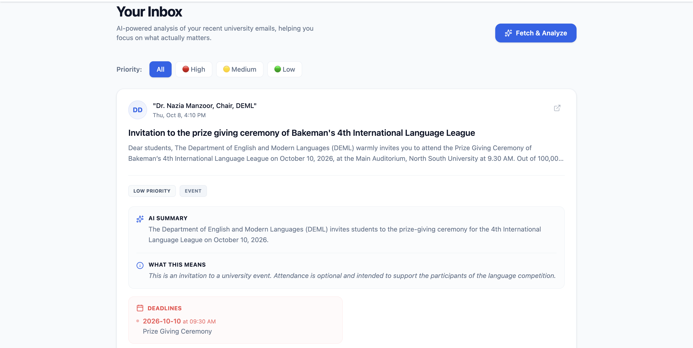

# UniPulse — AI-Powered University Assistant

> A smarter way to manage university emails and prioritize what matters.

UniPulse is an AI-powered university email assistant designed to help students organize incoming academic emails, understand important messages, and identify what needs their attention.

Built with React, TypeScript, FastAPI, and Google's AI and Gmail services, UniPulse brings email fetching and AI-assisted prioritization into one interface.

## Screenshots

### Dashboard

Your central view for working with university emails.


### Fetched Emails

View emails retrieved through the email integration.


### Low-Priority Emails

See emails categorized as lower priority to help focus on more important messages first.



## Features

- **Email integration** — retrieve university emails through the Gmail integration.
- **AI-assisted email analysis** — use Google's AI services to help process academic email content.
- **Email prioritization** — organize messages by priority to make important information easier to find.
- **Dashboard interface** — access email-related features through a central web interface.
- **Backend API** — handle application logic through a FastAPI backend.
- **Database integration** — use SQLite with SQLAlchemy for application data.
- **Modern frontend** — built with React, TypeScript, and Vite.

## Tech Stack

| Component | Technologies |
|---|---|
| Frontend | React, TypeScript, Vite |
| Backend | Python, FastAPI |
| Database | SQLite, SQLAlchemy, aiosqlite |
| Email integration | Gmail API, Google OAuth |
| AI integration | Google Gemini via the Google GenAI SDK |

## How It Works

1. Connect and configure the required Google services.
2. Retrieve emails through the Gmail integration.
3. Process email information through the application's backend and AI functionality.
4. Review fetched emails and their priority categories in the dashboard.

## Project Structure

```text
UniPulse/
├── backend/              # FastAPI backend
├── frontend/             # React + TypeScript application
├── screenshots/          # Project screenshots
├── .env.example          # Example environment configuration
├── .gitignore
├── requirements.txt      # Python dependencies
└── README.md
```

## Getting Started

### Prerequisites

- Python 3.10 or a compatible version for the project dependencies
- Node.js and npm
- Google credentials and API access required by the application's integrations

### 1. Clone the repository

```bash
git clone https://github.com/LabibCraftsSpells/UniPulse.git
cd UniPulse
```

### 2. Configure environment variables

Create your local environment file:

```bash
cp .env.example .env
```

Open `.env` and fill in the required values using the variable names and setup instructions in `.env.example`.

**Never commit your real `.env` file, API keys, OAuth secrets, or access tokens.**

Complete any required Google OAuth and API configuration before testing features that depend on Gmail or Gemini.

### 3. Set up the backend

From the project root:

```bash
python3 -m venv .venv
source .venv/bin/activate
pip install -r requirements.txt
```

Start the backend:

```bash
uvicorn backend.main:app --reload
```

The API should be available at:

- **Backend:** http://localhost:8000
- **API documentation:** http://localhost:8000/docs

### 4. Set up the frontend

Open a second terminal and run:

```bash
cd UniPulse/frontend
npm install
npm run dev
```

Open the local URL printed by Vite, usually http://localhost:5173.

Keep the backend and frontend running while using the application.

## Security and Privacy

- Keep API keys, OAuth client secrets, and access tokens out of source control.
- Store private configuration in your local `.env` file.
- Use the example environment file to document the required configuration without exposing real credentials.
- Email content may contain personal or sensitive information. Use appropriate care when processing it with external AI services.

## Future Improvements

Potential areas for further development include:

- More granular email priority controls
- Customizable academic email categories
- Reminders for deadlines and important announcements
- Improved filtering and search
- More detailed summaries of lengthy university emails

## Author

**LabibCraftsSpells**

GitHub: [@LabibCraftsSpells](https://github.com/LabibCraftsSpells)

## Disclaimer

UniPulse is a student-built project. Gmail access, AI analysis, and other integrations depend on the application's configuration and the permissions granted to the connected services.